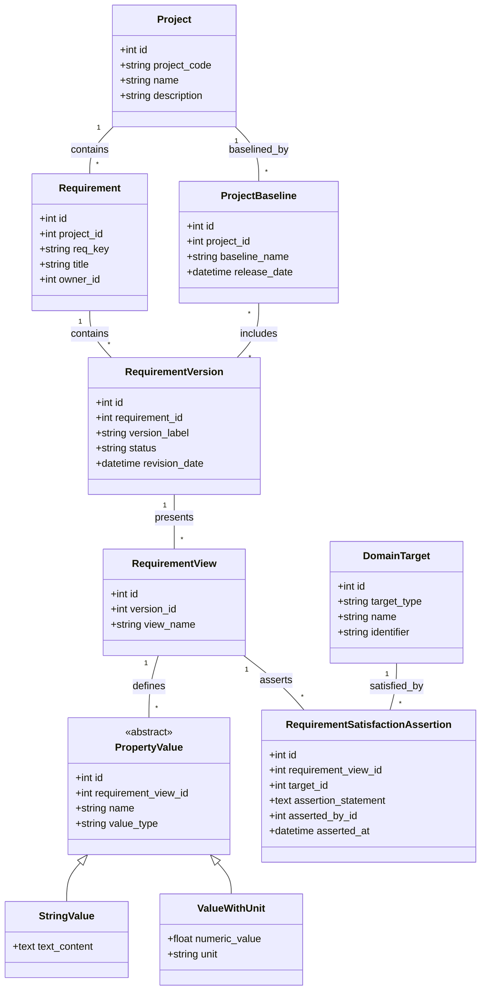
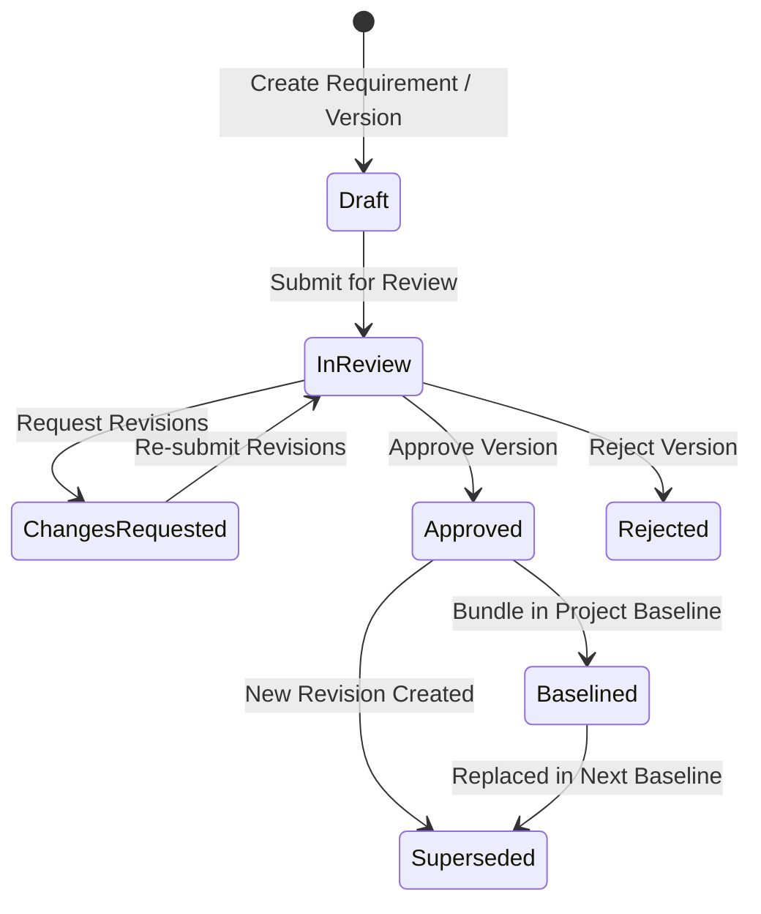
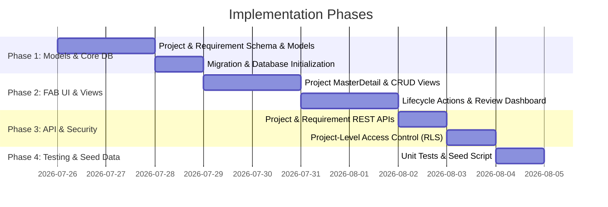

# Requirements Management System Plan

## 1. Executive Summary & System Architecture

This document outlines the architecture, data model, lifecycle workflow, Flask-AppBuilder (FAB) UI views, REST API, and implementation roadmap for building an enterprise-grade **Requirements Management System** in Flask-AppBuilder.

The application adheres to the domain model specification for systems engineering requirements tracking, supporting:
- Multi-project scoping (`Project` container).
- Full lifecycle governance from drafting to review, approval, and baselining.
- Complex requirement views, property values (text and unit-based), and polymorphic target assignments (`Part`, `Individual Part`, `Breakdown`, `Document`).
- Multi-directional traceability, decomposition, and satisfaction assertions.
- Immutable baselining and revision management.

---

## 2. Domain Model & Class Diagram



---

## 3. Database Models Specification (`reqman/app/models.py`)

### A. Project & Ownership
```python
import enum
from flask_appbuilder import Model
from flask_appbuilder.models.mixins import AuditMixin
from sqlalchemy import Column, Integer, String, Text, ForeignKey, Float, DateTime, Enum, Table
from sqlalchemy.orm import relationship

class Project(Model, AuditMixin):
    """Top-level container for scoped requirements."""
    __tablename__ = "project"
    id = Column(Integer, primary_key=True)
    project_code = Column(String(30), unique=True, nullable=False) # e.g., "PRJ-AVIONICS"
    name = Column(String(150), nullable=False)
    description = Column(Text, nullable=True)

    requirements = relationship("Requirement", back_populates="project", cascade="all, delete-orphan")
    baselines = relationship("ProjectBaseline", back_populates="project", cascade="all, delete-orphan")

    def __repr__(self):
        return f"[{self.project_code}] {self.name}"


class PartyType(enum.Enum):
    PERSON = "Person"
    ORGANIZATION = "Organization"


class PersonOrganizationSelect(Model, AuditMixin):
    """Represents individuals or organizational entities owning or asserting requirements."""
    __tablename__ = "person_organization_select"
    id = Column(Integer, primary_key=True)
    party_type = Column(Enum(PartyType), nullable=False)
    name = Column(String(150), nullable=False)
    email = Column(String(150), nullable=True)
    organization_name = Column(String(150), nullable=True)

    def __repr__(self):
        return f"{self.name} ({self.party_type.value})"
```

### B. Requirement Core Stack & Lifecycle State
```python
class VersionStatus(str, enum.Enum):
    DRAFT = "Draft"
    IN_REVIEW = "In Review"
    CHANGES_REQUESTED = "Changes Requested"
    APPROVED = "Approved"
    REJECTED = "Rejected"
    BASELINED = "Baselined"
    SUPERSEDED = "Superseded"


class Requirement(Model, AuditMixin):
    __tablename__ = "requirement"
    id = Column(Integer, primary_key=True)
    
    project_id = Column(Integer, ForeignKey("project.id"), nullable=False)
    project = relationship("Project", back_populates="requirements")

    req_key = Column(String(50), unique=True, nullable=False) # e.g., REQ-001
    title = Column(String(200), nullable=False)
    
    owner_id = Column(Integer, ForeignKey("person_organization_select.id"), nullable=True)
    owner = relationship("PersonOrganizationSelect")

    versions = relationship("RequirementVersion", back_populates="requirement", cascade="all, delete-orphan")

    def __repr__(self):
        return f"[{self.req_key}] {self.title}"


class RequirementVersion(Model, AuditMixin):
    __tablename__ = "requirement_version"
    id = Column(Integer, primary_key=True)
    requirement_id = Column(Integer, ForeignKey("requirement.id"), nullable=False)
    version_label = Column(String(20), nullable=False) # e.g. "1.0.0"
    status = Column(Enum(VersionStatus), default=VersionStatus.DRAFT, nullable=False)
    revision_date = Column(DateTime)
    
    requirement = relationship("Requirement", back_populates="versions")
    views = relationship("RequirementView", back_populates="version", cascade="all, delete-orphan")
    reviews = relationship("RequirementReview", back_populates="version", cascade="all, delete-orphan")

    def __repr__(self):
        return f"{self.requirement.req_key} v{self.version_label} ({self.status.value})"


class RequirementView(Model, AuditMixin):
    __tablename__ = "requirement_view"
    id = Column(Integer, primary_key=True)
    version_id = Column(Integer, ForeignKey("requirement_version.id"), nullable=False)
    view_name = Column(String(100), nullable=False) # e.g., "Systems View", "Safety View"

    version = relationship("RequirementVersion", back_populates="views")
    properties = relationship("PropertyValue", back_populates="requirement_view", cascade="all, delete-orphan")
    satisfaction_assertions = relationship("RequirementSatisfactionAssertion", back_populates="requirement_view", cascade="all, delete-orphan")

    def __repr__(self):
        return f"{self.version} - {self.view_name}"
```

### C. Requirement Relationships & Traceability
```python
class RequirementRelationship(Model, AuditMixin):
    __tablename__ = "requirement_relationship"
    id = Column(Integer, primary_key=True)
    source_id = Column(Integer, ForeignKey("requirement.id"), nullable=False)
    target_id = Column(Integer, ForeignKey("requirement.id"), nullable=False)
    relationship_type = Column(String(50), nullable=False) # e.g., "Conflicts", "Refines"


class RequirementTracingRelationship(Model, AuditMixin):
    __tablename__ = "requirement_tracing_relationship"
    id = Column(Integer, primary_key=True)
    source_view_id = Column(Integer, ForeignKey("requirement_view.id"), nullable=False)
    target_view_id = Column(Integer, ForeignKey("requirement_view.id"), nullable=False)
    trace_type = Column(String(50), default="Traces To")


class RequirementDecompositionRelationship(Model, AuditMixin):
    __tablename__ = "requirement_decomposition_relationship"
    id = Column(Integer, primary_key=True)
    parent_view_id = Column(Integer, ForeignKey("requirement_view.id"), nullable=False)
    child_view_id = Column(Integer, ForeignKey("requirement_view.id"), nullable=False)
```

### D. Polymorphic Properties Engine
```python
class PropertyValue(Model, AuditMixin):
    __tablename__ = "property_value"
    id = Column(Integer, primary_key=True)
    requirement_view_id = Column(Integer, ForeignKey("requirement_view.id"), nullable=False)
    name = Column(String(100), nullable=False)
    value_type = Column(String(50)) # Discriminator: string, unit, set, list

    requirement_view = relationship("RequirementView", back_populates="properties")

    __mapper_args__ = {
        "polymorphic_identity": "property_value",
        "polymorphic_on": value_type,
    }


class StringValue(PropertyValue):
    __tablename__ = "string_value"
    id = Column(Integer, ForeignKey("property_value.id"), primary_key=True)
    text_content = Column(Text, nullable=False)

    __mapper_args__ = {"polymorphic_identity": "string"}


class ValueWithUnit(PropertyValue):
    __tablename__ = "value_with_unit"
    id = Column(Integer, ForeignKey("property_value.id"), primary_key=True)
    numeric_value = Column(Float, nullable=False)
    unit = Column(String(30), nullable=False)

    __mapper_args__ = {"polymorphic_identity": "unit"}
```

### E. Target Types, Satisfaction Assertions & Baselines
```python
class TargetType(enum.Enum):
    PART = "Part"
    INDIVIDUAL_PART = "Individual Part"
    BREAKDOWN = "Breakdown"
    DOCUMENT = "Document"


class DomainTarget(Model, AuditMixin):
    """Represents external/system targets (Part, Individual Part, Breakdown, Document)."""
    __tablename__ = "domain_target"
    id = Column(Integer, primary_key=True)
    target_type = Column(Enum(TargetType), nullable=False)
    name = Column(String(150), nullable=False)
    identifier = Column(String(100), nullable=False)

    def __repr__(self):
        return f"[{self.target_type.value}] {self.name} ({self.identifier})"


class RequirementSatisfactionAssertion(Model, AuditMixin):
    __tablename__ = "requirement_satisfaction_assertion"
    id = Column(Integer, primary_key=True)
    requirement_view_id = Column(Integer, ForeignKey("requirement_view.id"), nullable=False)
    target_id = Column(Integer, ForeignKey("domain_target.id"), nullable=False)
    assertion_statement = Column(Text, nullable=False)
    
    asserted_by_id = Column(Integer, ForeignKey("person_organization_select.id"), nullable=False)
    asserted_at = Column(DateTime, nullable=False)

    requirement_view = relationship("RequirementView", back_populates="satisfaction_assertions")
    target = relationship("DomainTarget")
    asserted_by = relationship("PersonOrganizationSelect")


class RequirementReview(Model, AuditMixin):
    """Review feedback log for a requirement version."""
    __tablename__ = "requirement_review"
    id = Column(Integer, primary_key=True)
    version_id = Column(Integer, ForeignKey("requirement_version.id"), nullable=False)
    reviewer_id = Column(Integer, ForeignKey("person_organization_select.id"), nullable=False)
    comments = Column(Text, nullable=False)
    recommended_status = Column(Enum(VersionStatus), nullable=False)

    version = relationship("RequirementVersion", back_populates="reviews")
    reviewer = relationship("PersonOrganizationSelect")


baseline_version_association = Table(
    "baseline_version_association",
    Model.metadata,
    Column("baseline_id", Integer, ForeignKey("project_baseline.id"), primary_key=True),
    Column("version_id", Integer, ForeignKey("requirement_version.id"), primary_key=True),
)


class ProjectBaseline(Model, AuditMixin):
    """Formal release snapshot bundling approved requirement versions."""
    __tablename__ = "project_baseline"
    id = Column(Integer, primary_key=True)
    project_id = Column(Integer, ForeignKey("project.id"), nullable=False)
    baseline_name = Column(String(100), nullable=False) # e.g., "Baseline 1.0 - SRR"
    release_date = Column(DateTime, nullable=False)

    project = relationship("Project", back_populates="baselines")
    versions = relationship("RequirementVersion", secondary=baseline_version_association)

    def __repr__(self):
        return f"{self.project.project_code} - {self.baseline_name}"
```

---

## 4. Requirement Lifecycle Management



---

## 5. Flask-AppBuilder View Architecture (`reqman/app/views.py`)

### A. Project Master-Detail & Requirement Inline View
```python
from flask_appbuilder import ModelView, MasterDetailView
from flask_appbuilder.models.sqla.interface import SQLAInterface
from .models import Project, Requirement

class RequirementInlineView(ModelView):
    datamodel = SQLAInterface(Requirement)
    list_columns = ["req_key", "title", "owner"]

class ProjectMasterView(MasterDetailView):
    datamodel = SQLAInterface(Project)
    related_views = [RequirementInlineView]
    show_columns = ["project_code", "name", "description"]
```

### B. Version Lifecycle Views & FAB `@action` Transitions
```python
from flask import flash, redirect
from flask_appbuilder import ModelView, action
from flask_appbuilder.models.sqla.interface import SQLAInterface
from .models import RequirementVersion, VersionStatus

class RequirementVersionView(ModelView):
    datamodel = SQLAInterface(RequirementVersion)
    
    list_columns = ["requirement.req_key", "version_label", "status", "changed_on", "changed_by"]
    show_columns = ["requirement", "version_label", "status", "revision_date", "views", "reviews"]
    search_columns = ["requirement", "status", "version_label"]

    def pre_update(self, item):
        """Enforce immutability locking on approved or baselined versions."""
        if item.status in [VersionStatus.APPROVED, VersionStatus.BASELINED]:
            raise Exception("Approved or Baselined requirement versions are read-only. Create a new revision.")

    @action("submit_for_review", "Submit for Review", "Submit selected draft(s) for formal review?", "fa-paper-plane", single=True)
    def submit_for_review(self, items):
        for item in items:
            if item.status == VersionStatus.DRAFT:
                item.status = VersionStatus.IN_REVIEW
                self.datamodel.edit(item)
                flash(f"{item} submitted for review.", "info")
            else:
                flash(f"Cannot submit {item}: Only Drafts can be submitted.", "warning")
        return redirect(self.get_redirect())

    @action("approve_version", "Approve Requirement", "Approve selected requirement version(s)?", "fa-check-circle", single=True)
    def approve_version(self, items):
        for item in items:
            if item.status == VersionStatus.IN_REVIEW:
                item.status = VersionStatus.APPROVED
                self.datamodel.edit(item)
                flash(f"{item} successfully approved.", "success")
            else:
                flash(f"Cannot approve {item}: Must be 'In Review'.", "warning")
        return redirect(self.get_redirect())

    @action("request_changes", "Request Revisions", "Request revisions on selected version?", "fa-undo", single=True)
    def request_changes(self, items):
        for item in items:
            if item.status == VersionStatus.IN_REVIEW:
                item.status = VersionStatus.CHANGES_REQUESTED
                self.datamodel.edit(item)
                flash(f"Revisions requested for {item}.", "warning")
        return redirect(self.get_redirect())
```

### C. Reviewer Dashboard & Baseline Views
```python
from flask_appbuilder import BaseView, expose, has_access

class ReviewerDashboardView(BaseView):
    default_view = "pending_reviews"

    @expose("/pending/")
    @has_access
    def pending_reviews(self):
        in_review_versions = (
            self.appbuilder.get_session
            .query(RequirementVersion)
            .filter_by(status=VersionStatus.IN_REVIEW)
            .all()
        )
        return self.render_template(
            "reviewer_dashboard.html",
            pending_items=in_review_versions
        )


class BaselineInlineView(ModelView):
    datamodel = SQLAInterface(RequirementVersion)
    list_columns = ["requirement.req_key", "version_label", "status"]


class ProjectBaselineMasterView(MasterDetailView):
    datamodel = SQLAInterface(ProjectBaseline)
    related_views = [BaselineInlineView]
    show_columns = ["baseline_name", "release_date", "project"]
```

---

## 6. REST API & Security Architecture (`reqman/app/api.py`)

- **ModelRestApi Endpoints**:
  - `ProjectApi`, `RequirementApi`, `RequirementVersionApi`, `RequirementViewApi`, `ProjectBaselineApi`.
- **Row-Level Security (RLS)**:
  - Custom `BaseFilter` applied on `Project` and `Requirement` queries based on authenticated `g.user` role and project assignments.

---

## 7. App Initialization & Menu Structure (`reqman/app/__init__.py`)

```python
def create_app() -> Flask:
    app = Flask(__name__)
    app.config.from_object("config")
    with app.app_context():
        db.init_app(app)
        appbuilder.init_app(app, db.session)

        # 1. Projects & Requirements
        appbuilder.add_view(ProjectMasterView, "Projects", icon="fa-cubes", category="Requirements")
        appbuilder.add_view(RequirementView, "All Requirements", icon="fa-list-alt", category="Requirements")

        # 2. Lifecycle & Review Workflows
        appbuilder.add_view(ReviewerDashboardView, "Reviewer Inbox", icon="fa-tasks", category="Lifecycle & Reviews")
        appbuilder.add_view(RequirementVersionView, "Version History & Actions", icon="fa-history", category="Lifecycle & Reviews")

        # 3. Baselines & Traceability
        appbuilder.add_view(ProjectBaselineMasterView, "Project Baselines", icon="fa-bookmark", category="Baselines & Traceability")
        
        # 4. Configuration & Domain Targets
        appbuilder.add_view(DomainTargetView, "Parts & Documents", icon="fa-database", category="Configuration")
        appbuilder.add_view(PersonOrganizationSelectView, "Parties & Owners", icon="fa-id-card", category="Configuration")

        # 5. REST APIs
        appbuilder.add_api(ProjectApi)
        appbuilder.add_api(RequirementApi)

        db.create_all()
    return app
```

---

## 8. Implementation Roadmap


